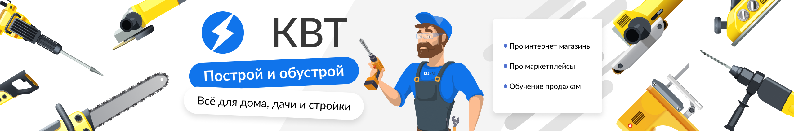

# Loyiha

`Loyihani nomi --- 5KVT ` https://5kvt-n18.vercel.app/ Elektr asbob uskunalari bo'yicha onlayn web site

1. Pages --- Home, Catolog, Product info and Contact pages
2. Pagelarga masullar
3. Home page --- GitHub [@omonboyweb](https://github.com/omonboyweb)
4. Catolog page --- GitHub [@sadriddinovtohir](https://github.com/sadriddinovtohir)
5. Product info page --- GitHub [@Abdurahimov110](https://github.com/Abdurahimov110)
6. Contact page --- GitHub [@boburxonmaxmudovich](https://github.com/boburxonmaxmudovich)

# Maqsad

## Ushbu loyiha orqali

1.  Moslashuvchan dizayn va adaptivni
2.  Jamoa bilan ishlash ko'nikmalari
3.  Real loyihalarga tayyorlanib borish va mustahkamlash

# Foylalingan texnologiyalar

1. Html
2. Scss
3. Figma
4. Git & GitHub

# O'rnatish

```bash
git clone https://github.com/omonboyweb/git-repo.git

## Loyihani yuklaganda
 git pull  'lohida ozgarishlarni yuklab olish'
 git add .
 git commit -m 'Ozgarish boyicha qisqa izoh'
 git push origin --brench nomi
 git push


```
